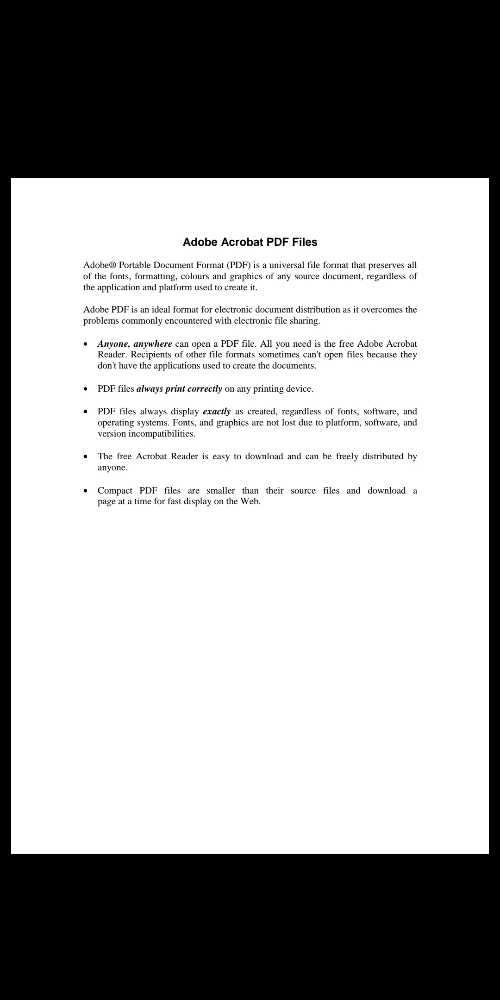
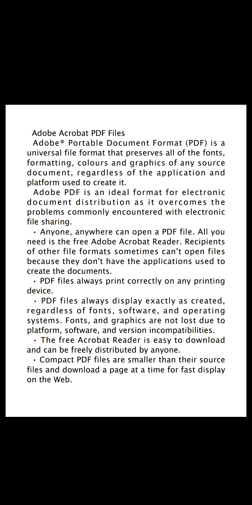

# readPDF
### makes pdf files readable on mobile

The program formats pdf files so that it's comfortable to read on a phone. It makes the font bigger and justifies text. Doesn't support images yet.

Examples
Before                     |  After
:-------------------------:|:-------------------------:
   |  
   |  