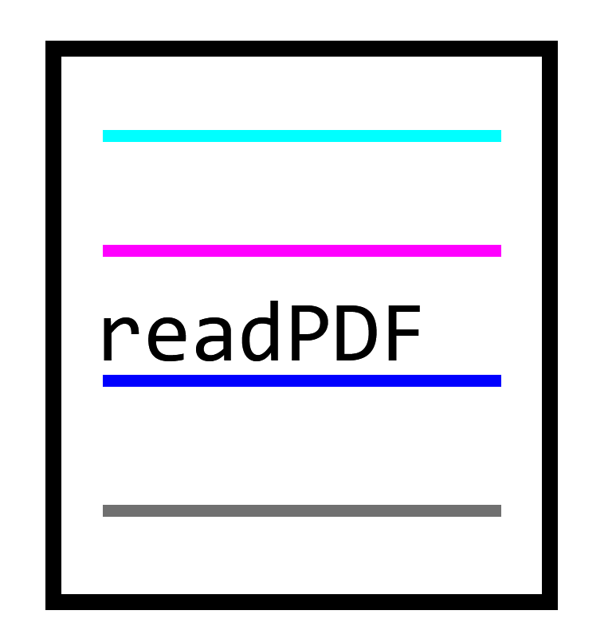
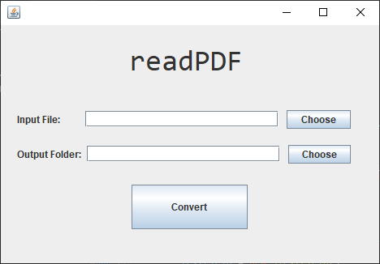
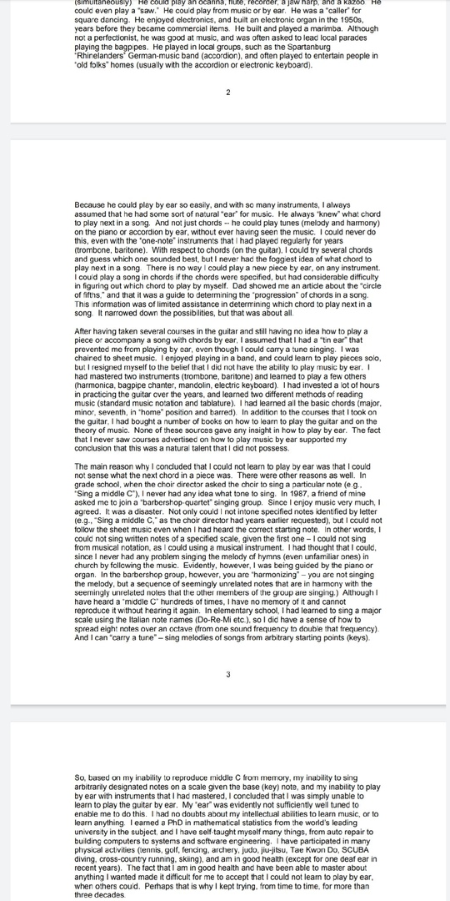
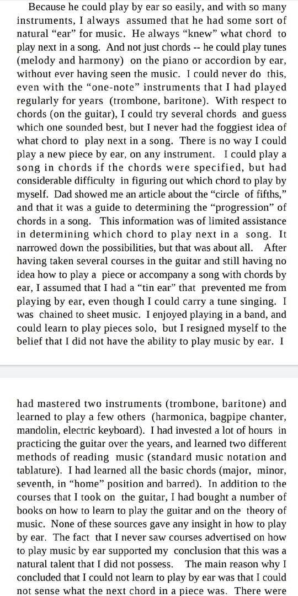
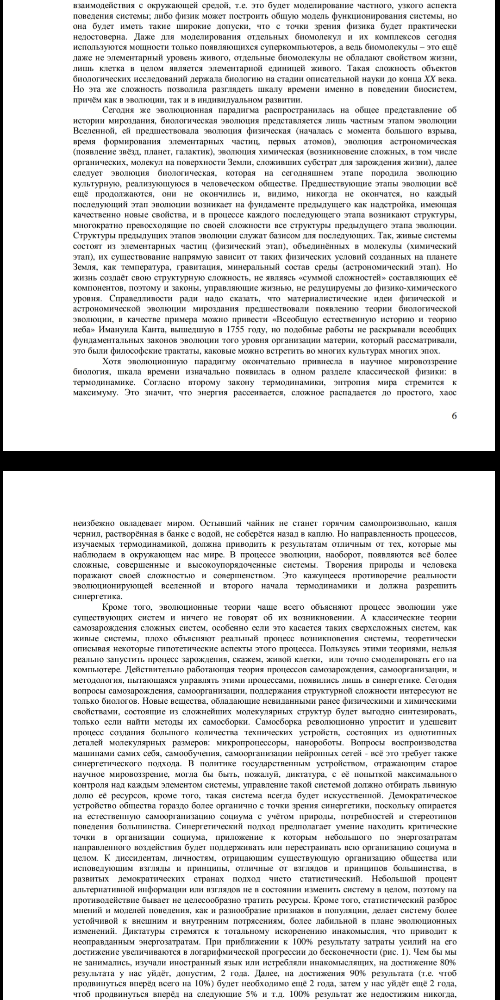

### makes pdf files readable on mobile

The program formats pdf files so that it's comfortable to read on a phone. It makes the font bigger and justifies text. Supports multiple languages and images (images may not be in the same place after conversion).

Examples

  
   

  
   

  
   

